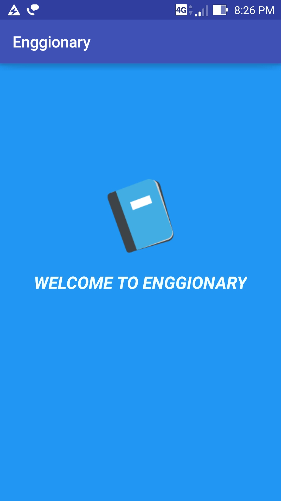
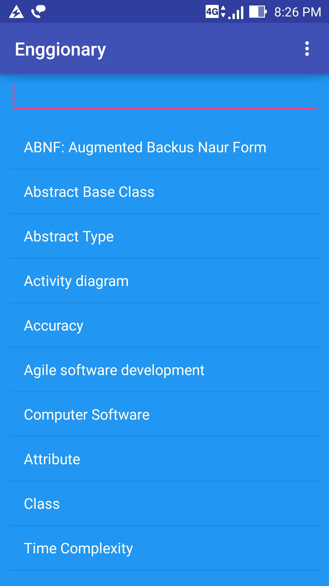
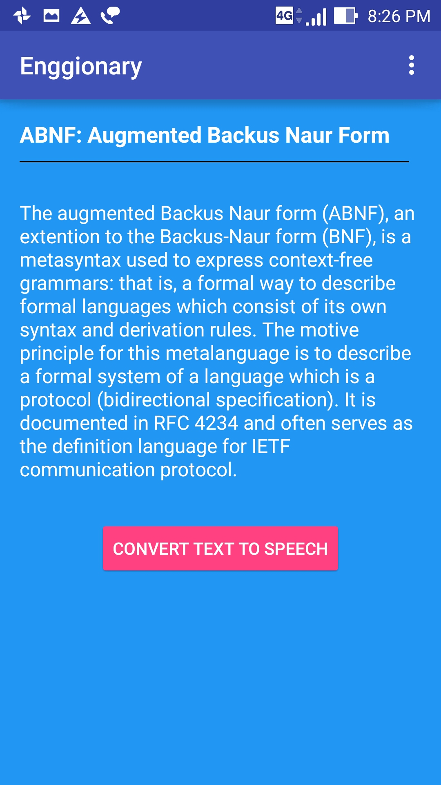
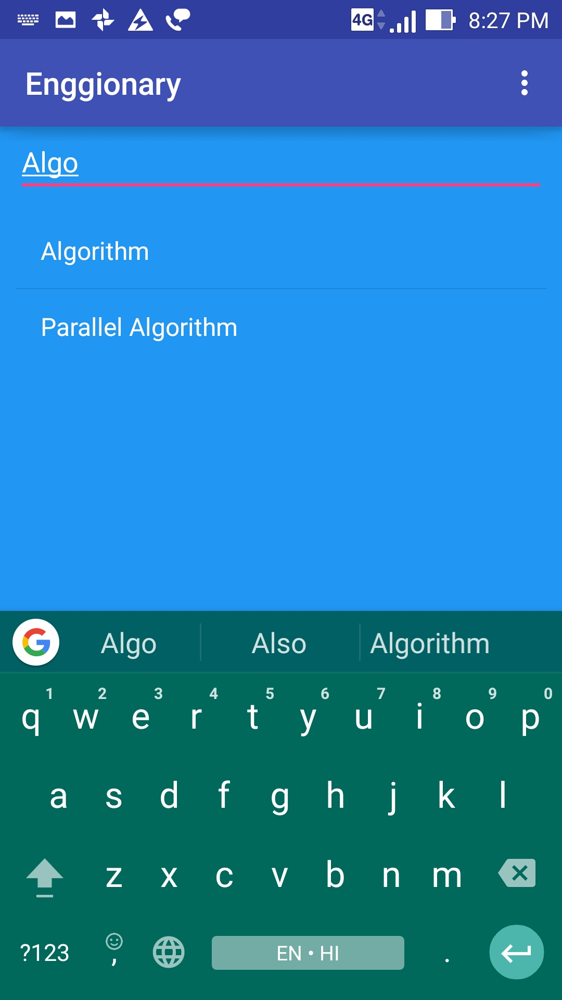

# Android-Dictionary-App
A dictionary for computer science students

# Features

•  Easy and light weight.

•  Works without Internet (offline access).

•  Easy and functional user interface.

•  Search any word from the list.

•  Text to Speech.

•  Share with your friends.

# Screenshots

  

  
